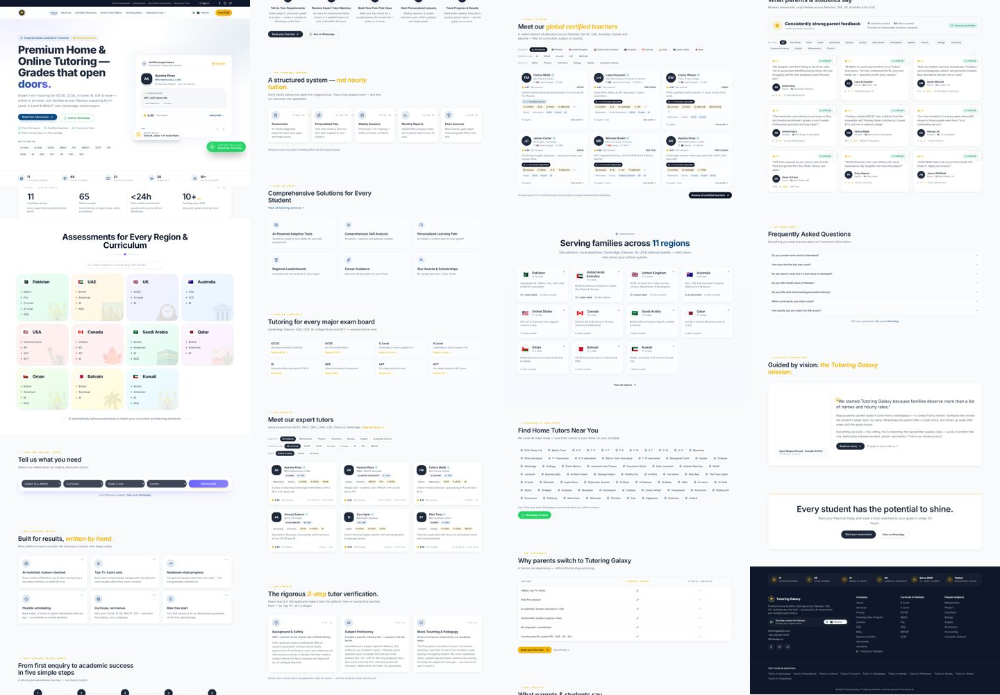
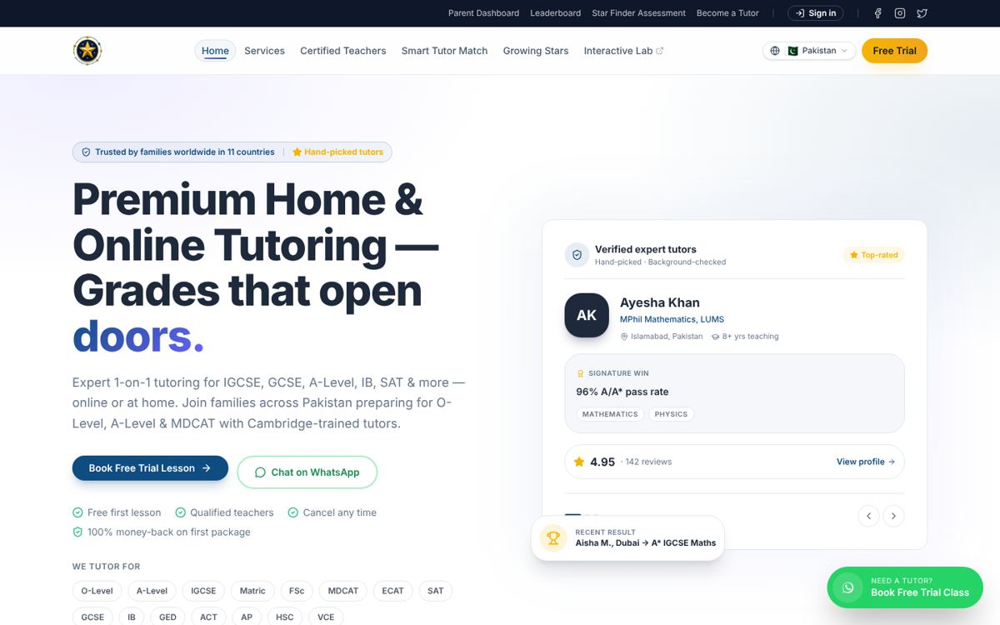
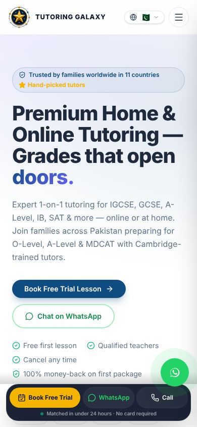
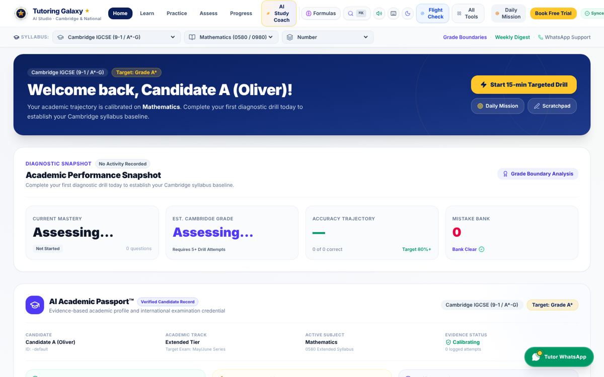
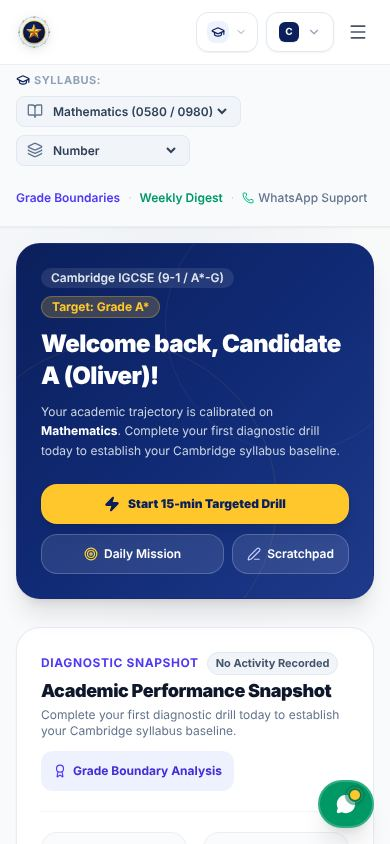

# Tutoring Galaxy: current-state audit

_Date: 8 Oct 2026 · Phase 1 of the rebuild (understand → audit → inspiration → structure → build)_

**Reviewed:**
- Lovable project export (`tg_8_oct_26_lovable-project`)
- Google AI Studio export (`tutoring-galaxy-oct-8-2026`)
- Both projects, run locally and screenshotted at desktop (1440px) and mobile (390px) widths

The live domains (`www.tutoringgalaxy.com`, `tutoringgalaxy.ai.studio`) were blocked from the review environment.
Everything below comes from the source code and from those local renders. Re-check against the live sites before
sharing anything with the client.

We use the old projects **for reference only**. No code or UI gets copied. We reuse **content** (facts, wording, offers)
where it's good, and we use the **problems** below as the list of things the new site has to fix.

---

## 1. What the business is

Tutoring Galaxy is a tutoring agency founded in 2016 by **Syed Waqas Ahmad** (Founder & CEO).
It's based in Pakistan (Islamabad) and serves families in **11 countries**: Pakistan, UAE, UK, Australia, USA, Canada,
Saudi Arabia, Qatar, Oman, Bahrain and Kuwait.

- **Offer:** 1-to-1 **home and online tutoring** for school and entrance exams. The first trial class is **free**.
- **Curricula:** O Level, A Level, IGCSE, GCSE, IB, Matric, FSc, MDCAT, ECAT, SAT, AP, ACT, GED, HSC, VCE, Common Core and more.
- **Subjects:** 21, from Maths, Physics, Chemistry, Biology and English through to Urdu, Arabic, Psychology, CS and others.
- **Pricing (PKR / month):** Starter 15,000 · Growth 35,000 (marked "most popular") · Elite custom.
  International families are billed in local currency.
- **Funnel:** almost every call to action leads to **WhatsApp** (+92 334 091 7037) or the free-trial form.
- **Contact:** tutoringgalaxy@gmail.com · Facebook, Instagram and X `@tutoringgalaxy`.
- **"AI" angle:** AI tutor matching, the "Star Finder" / "Growing Stars" assessment, and the AI practice engine.

## 2. What exists today: three separate products from three AI builders

| | **Marketing site + marketplace** | **Practice Engine** | **"Interactive Lab"** |
|---|---|---|---|
| Built with | Lovable | Google AI Studio | Manus |
| URL | tutoringgalaxy.com | tutoringgalaxy.ai.studio (Cloud Run) | tutorgalaxy-nocrka2x.manus.space |
| Stack | TanStack Start, React 19, Tailwind 4, shadcn/ui, Supabase | Vite + React 19 single-page app, Express `server.ts`, Gemini (`@google/genai`) | not supplied |
| Size | ~45k lines, ~100 routes, 45 database migrations | **~148k lines**, 190+ components, 69 data files, a 3,500-line `App.tsx` | n/a |
| AI | Lovable AI gateway → `google/gemini-3-flash-preview` | Gemini `gemini-3.8-flash`, called from the server | n/a |
| Data | Supabase Postgres | **JSON files on disk** (`data/learning_evidence.json`) | n/a |

The site menu links out to the Manus lab, and the Practice Engine links back to tutoringgalaxy.com.
Visitors jump between **three different looks, three different logins and three different domains**.

## 3. Problems found

### 3.1 UI and design consistency (the main complaint)

Numbers measured from the code and the rendered pages:

| Measure | Marketing site | Practice Engine |
|---|---|---|
| Hardcoded hex colors in components | 29 | **116** |
| Tailwind color families in use | 18 (slate, amber, emerald, green, red, rose, violet, sky…) | 12, with **14,361** `slate-*` uses alone |
| One-off pixel font sizes (`text-[10px]`, `text-[11px]`…) | 200+ | **1,580** |
| Corner radius styles in use | 8 (`rounded`, `-sm`, `-md`, `-lg`, `-xl`, `-2xl`, `-3xl`, `-full`) | 7 |
| Distinct colors rendered on the homepage | ~70 | ~63 |

- **No design system.** The Lovable theme defines tokens, then adds "legacy alias" tokens on top
  (`fn-ink`, `fn-teal`, `fn-terra`…, all pointing at the same few colors). Components skip both and use raw Tailwind colors.
  The Practice Engine has no tokens at all.
- **Two different brands.** The site uses Poppins + Inter with academic blue, purple and gold.
  The Practice Engine uses Inter only, with navy, yellow and indigo, in a different layout style.
- **Mixed visual styles on one page.** On the homepage, clean cards sit next to pastel country cards with
  illustrations, a dark navy footer, emoji subject icons and checkmark comparison tables. Each section looks like it
  came from a different template, which is what happens when each section is prompted separately.
- **Generic AI look.** Purple-to-blue gradients, "glass" badges, everything rounded, and a star emblem logo that doesn't
  hold up at small sizes.
- **Practice Engine header overflows on desktop.** It has 13+ items: Home, Learn, Practice, Assess, Progress,
  AI Study Coach, Formulas, search, sound, keyboard, theme, Flight Check, All Tools, Daily Mission, Book Free Trial,
  Synced… The last one is cut off at 1440px, and "AI Study Coach" wraps onto 3 lines.

### 3.2 UX and information architecture

- **The homepage is far too long:** 19 sections, **16,000px on desktop and 32,700px (~39 screens) on mobile.**
  Order: Hero → Outcomes → Region/Curriculum → Tutor finder → Why us → How it works → Learning journey → Services →
  Curricula → Tutors → Verification → Global teachers → Regions → Areas → Comparison → Testimonials → FAQ → Founder → CTA.
- **Repeated content.** Tutors appear twice (expert tutors and global teachers), regions appear twice
  (Region/Curriculum band and Regions showcase), and "how it works" appears twice (How it works and Learning journey).
- **Too many CTAs.** The homepage has **14 differently worded** CTAs: "Free Trial", "Book Free Trial",
  "Book Free Trial Lesson", "Book your free trial", "Chat on WhatsApp", "Ask us on WhatsApp", "Ask on WhatsApp",
  "WhatsApp Us Now", "WhatsApp us", "Call"…
- **Crowded mobile screen.** The floating WhatsApp button, a fixed bottom bar (Free Trial / WhatsApp / Call) and the
  hero buttons are all visible at once and overlap the content.
- **Two navigation bars, 10 links.** Parent Dashboard, Leaderboard, Star Finder Assessment, Become a Tutor, Home,
  Services, Certified Teachers, Smart Tutor Match, Growing Stars, Interactive Lab. Some of them link off-site.
- **Overlapping routes:** `/tutors` and `/teachers`, `/city/$slug` and `/cities/$city`, `/subject/$slug` and
  `/subjects/$subject`, `/assessment` and `/assessments`, `/regions` and `/world`, plus `/academy`, `/prep`, `/learn`,
  `/practice` and `/syllabus`. That's around 100 routes for an agency site.
- **Practice Engine has no URLs.** Almost everything opens in a modal (223 modal references in `App.tsx`), so nothing can
  be linked to, bookmarked or indexed. Its features have jargon names ("Flight Check", "Chronos Revision Planner",
  "Galaxy Honors Vault", "Socratic Crucible", "Lorentz Lab 3D", "Viva Voce Oral Examiner"…) and there are 60+ of them.
- **The Practice Engine shows demo data to every visitor.** It opens with "Welcome back, Candidate A (Oliver)!" and a
  "Verified Candidate Record" badge on an empty profile.

### 3.3 Content and trust (needs the client to confirm)

- **Tutors and reviews look like placeholders.** There are two separate tutor lists (`teachers.ts` with 12 entries and
  `tutors.ts` with 15). Avatars are generated cartoons (DiceBear). The hero shows "Ayesha Khan · 4.95 · 142 reviews ·
  96% A/A* pass rate", and testimonials make specific grade claims ("D → A* in 8 weeks").
  **If these aren't real people and real results, they're a legal and trust risk** (fake reviews) and must be replaced
  or removed.
- **Unproven claims:** "100% money-back on first package", "Matched in under 24 hours", "Average reply < 5 min",
  "Background-checked", "Certified teachers", "™" on "AI Academic Passport".
- **Pricing contradicts itself.** The Starter plan says "4 sessions/month" in its description and "5 sessions / month"
  in the feature list.
- **Mixed local and global focus.** The homepage title targets Pakistan, while the copy targets 11 countries. FAQs are
  about Islamabad, and the stats say "11 countries" in one place and "11 regions" in another.
- **Broken links between products.** The Practice Engine links to tutoringgalaxy.com pages that don't exist
  (`/verify`, `/verify-credential`, `/portfolio`, `/locker`, `/walkthrough/...`). It also embeds a hardcoded **preview**
  Cloud Run URL (`ais-pre-…run.app`) instead of the production one.

### 3.4 Security (must fix before handling real student data)

**Practice Engine (`server.ts`):**
- 🔴 **Hardcoded master PINs.** Parent PIN `1234`, tutor `9876` and teacher `4321` are accepted for *any* student.
  The tutor and teacher tokens grant access to **all** students (`authorizedStudentIds: ["*"]`).
- 🔴 **No authentication on student-data endpoints.** `GET /api/learning-evidence/:candidateProfileId` and its
  `/summary` return any student's records to anyone who has the ID.
- 🔴 **Gemini endpoints aren't rate-limited and don't require login** (`/api/ai-tutor`, `/api/grade-working`,
  `/api/scan-math-working`, etc.). Anyone can run up the AI bill.
- 🟠 **Sessions and student records are kept in memory and in JSON files on a Cloud Run container.** That storage is
  wiped on redeploy and not shared between instances, so data loss is effectively guaranteed. Student data is also
  stored with no encryption or retention policy.
- 🟠 **Security tokens use `Math.random()`**, which isn't secure for this.
- 🟢 The Gemini API key stays on the server and doesn't reach the browser.

**Marketing site (Lovable):**
- 🟢 The `.env` only holds the Supabase *publishable* key, which is meant to be public.
- 🟢 Admin server functions check the `admin` role on the server.
- 🟠 Admin page access is decided in the browser, and actual security depends on Supabase row-level security (RLS)
  being correct across 45 migrations. That needs a proper review.

### 3.5 SEO

- 🟢 There's a sensible base to learn from: per-page titles, descriptions and canonical links, a `robots.txt` that blocks
  the app pages, `llms.txt`, a sitemap route, and FAQ structured data.
- 🔴 **Thin pages generated at scale.** Templates for city × curriculum × subject, `regions/$region/$slug`,
  `locations/$area` and so on can produce thousands of near-identical pages. Google's spam policies call this
  "scaled content abuse". With the duplicate routes above, the pages also compete with each other.
- 🟠 **FAQ structured data on the homepage covers Islamabad-specific questions**, while the page targets 11 countries.
- 🟠 **The Practice Engine can't be indexed** (single-page app, modals, no URLs). That's acceptable for an app, but it
  means none of its content helps search.
- 🟠 **Heavy, very long pages** hurt Core Web Vitals on mobile.

### 3.6 Code health (why patching the old projects isn't worth it)

- The AI Studio export has **60+ `fix_*.py` / `update_*.py` scripts** that rewrote the source with string replacements
  (`fix_header3.py`, `fix_tracker_duplicate2.py`…). The code was patched over and over, not designed.
- `.lovable/` holds 8 self-audits and 15 "phase" plans. They score their own work "PASS" while the problems above remain.
- "Verification test" files ship inside `src/` (`v501_v550_verification.ts`, etc.).
- Two separate AI integrations, two databases (Supabase and JSON files) and two auth systems (Supabase auth and PINs).

## 4. What's worth keeping (as reference)

- **Facts and offer:** founder story and mission quote, founded 2016, the 11 countries, the curricula and subject lists
  with their one-line descriptions, pricing tiers, free trial, WhatsApp-first contact.
- **The structured data in `src/data/seo.ts`** (regions → cities → curricula → subjects) is a good starting point for our
  content model. We just publish far fewer pages from it.
- **Question banks** in the AI Studio project (Cambridge 0580 maths topics, SAT, MDCAT, ECAT, GED…), if the client owns
  that content and it has been quality-checked.
- **The "business stats" rule** in the Lovable code: only show numbers that can be proven. That's a good rule. Keep it.
- **Product ideas worth keeping:** smart tutor match, free trial booking, a diagnostic assessment, a parent progress
  report and AI practice with step-by-step feedback.

## 5. Proposed direction (to agree before design)

1. **One product, one brand, one domain.** Build a Next.js site on tutoringgalaxy.com with
   (a) the public marketing site and (b) a logged-in practice area at `/app` (or `app.` subdomain).
   Retire the Manus lab and the separate AI Studio app.
2. **Small, focused sitemap.** Home, Tutoring (online / home), Curricula, Subjects, Tutors, Pricing, How it works,
   About, Contact/Book trial, Blog/Resources. Only add city or country pages where there's real local content.
3. **Design system first.** One type pairing, one palette with semantic tokens, one spacing scale, two or three corner
   radius values, and one button set with a single primary CTA label ("Book a free trial") plus one WhatsApp CTA.
4. **Homepage of about 7 sections:** hero, trust proof, how it works, curricula and subjects, tutors, results and
   testimonials, pricing teaser and FAQ, final CTA.
5. **Gemini done safely:** server-side only, behind login, rate-limited, with per-user quotas and stored in a real
   database. Possibly through Vertex AI or the Gemini API with a project the client owns.
6. **Real data only:** the client supplies real tutor profiles, real testimonials (with permission) and real results.
   Until then the site shows nothing in their place rather than inventing them.

## 6. Questions for the client

1. Which tutors, testimonials and stats are real? Can we get photos and permission?
2. Main market: Pakistan first with international online, or all 11 countries equally?
3. Is the money-back guarantee real? What are the terms?
4. Should the practice/AI engine be part of the first launch, or come in phase 2 after the marketing site?
5. Who owns the Supabase project, the Google Cloud / AI Studio project and the domain/DNS? Where is it hosted now?
6. Should any existing data (leads, enrollments, question banks) carry over?
7. Are the brand assets (logo, colors) fixed, or open to a refresh?

## 7. Next steps

1. Re-check the **live** sites once network access is allowed, and add anything that differs from this audit.
2. **Inspiration round:** collect 6–10 reference sites (tutoring marketplaces, edtech, premium service brands) and agree
   on a direction.
3. **Structure:** sitemap, page outlines, content model and design tokens. Then the build plan.

---

### Screenshots (local render of the exported code)

| Marketing site, desktop | Marketing site, mobile |
|---|---|
|  |  |

| Practice Engine, desktop | Practice Engine, mobile |
|---|---|
|  |  |
